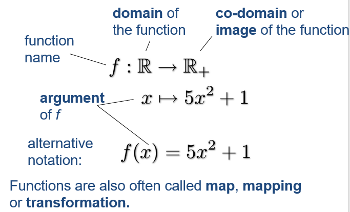
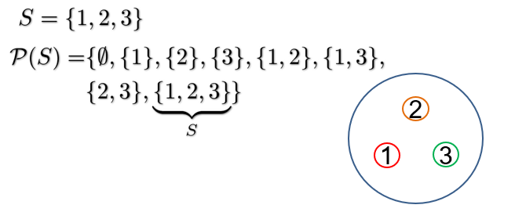
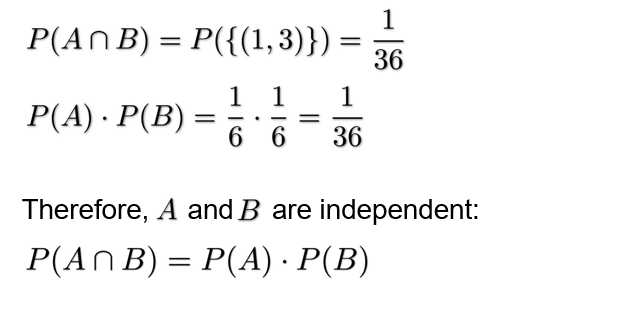
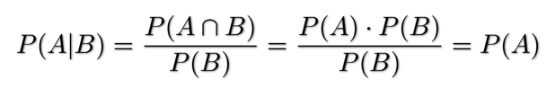

[toc]

# 1-Number System


 **Natural Numbers**	| 0, 1, 2, 3,...

 **Integers**	| -2, -1, 0, 1, 2,...

 **Rational Numbers**	| 4/8, -4/6, 2/3

 **Real Numbers** | sqrt(2), pi(3.14159), e(2.17182)

 **Complex Numbers** | 6+4i


## Natural Numbers

= {1, 2, 3,...}

* Addition or multiplication of two natural numbers results in another natural number
* Subtraction or division of two natural numbers does not always result in another natural number

can be generated with a successor relation. Any natural number can be obtained from 1 by applying the *successor relation* [S(n) = n+1]


## Integers

 = {-2, -1, 0, 1, 2...}

* Addition, multiplication and subtraction of two integers results in another integer
* Division of two integers does not always result in another integer

 can be generated with both successors and predecessors


## Rational Numbers

 = all numbers that can be written in the form a/b, where a and b are integers

* Closed under division 
* Has an ordering (less than or greater than relation) but no successor relation


## Real Numbers

 can be thought of those numbers consisting of unending decimal places (512.5257623.....)

* Real numbers are sometimes called *irrational numbers*


## Complex Numbers

* Squares of real numbers are positive. There is no solution to x^2^ = -1.
* Introduce *imaginary number i* with:

$$
i^2 = -1 \Longleftrightarrow i =\sqrt-1
$$

* Every complex number can be written as:


* Complex plane:


* Remember we can substitute i^2^ to -1 and -i^2^ to 1


# 2-Summation and Product


## Summation


The above summation is equivalent to the below for-loop in Java:

```java
int a = 0;
for (int j = 1; j <= 3; j++){
    a = a + xj
}
```

Empty sums are zero:


Order of expansion does not matter:
$$
Associativity \\a+(b+c)=(a+b)+c
$$

$$
Commutativity \\a+b=b+a
$$


## Product


Think about it as a for-loop with multiplication inside instead of summation


Empty products are 1:


# 4-Sets

Sets are collections of elements. The general notation uses curly braces {1, 2, 3, 4}

 = {1, 2, 3, 4, ...}


## Set Relations


$$
A\ is\ a\ subset\ of\ B\\ A \subset B \\                                                 A\ is\ a\ subset\ of\ or\ equal\ to\ A \\  A \subseteq B \\\\                             B\ is\ a\ superset\ of\ A \\  B \supset A \\                                             B\ is\ a\ superset\ of\ or\ equal\ A \\ B \supseteq A
$$

$$
A = \{1,2,3,4,5,6\},\ B=\{1,2,3\} \\
A \supset B\ \ \ \ \ B \subset A
$$


## Cardinality

The cardinality of a set is the number of elements in the set:
$$
A = \{1,2,5,19\} \\
card(A) = |A| = 4 \\
card(\N) = \infin
$$


## Union


$$
A \cup B = \{x : x \in A\ or\ x \in B \} \\
\{1,2,3\} \cup \{2,3,5\} = \{1,2,3,5\}
$$


## Intersection


$$
A \cap B = \{x : x \in A\ and\ x \in B\} \\
\{1,2,3\} \cap \{2,3,4\} = \{2,3\}
$$


## Subtraction


$$
A \setminus B = \{x \in A : x \notin B \} \\
\{1,2,3,4\} \setminus \{1,3\} = \{2,4\}
$$


## Compliment


$$
if\ A \subset B\ then\ A^C=B \setminus A \\
A^C\ is\ the\ complement\ of\ A\ in\ B \\
B = \{1,2,3,4,5\},\ A = \{4,5\} \\
A^C = \{1,2,3\}
$$


## Symbols


# 5-Regular Expressions


## Alphabet & Words

An **alphabet** ***S*** is a set of **letters**: 
$$
S = \{0,1,2,3,4,5,6,7,8,9\} \\
S = \{a,b,c,...,x,y,z\}
$$
A **word** is a combination of **letters** from ***S***:
$$
1001 \\
hello \\
zptfg \\
\epsilon = the\ empty\ string
$$


## Languages

A language can be defined over an alphabet ***S***:

* The empty language
* The singleton language {a} is regular (a in ***S***)
* If A and B are regular languages, then A U B (union) and A ^o^ B (concatenation) and A* (Kleene star) are regular
* No other languages are regular


$$
Alphabet\ S = \{a,b\},\ Language\ A = \{a,aa\},\ Language\ B = \{b,bb\} \\
A \cup B = \{a,aa,b,bb\} \\
A\ o\ B = \{ab,abb,aab,aabb\} \\
A* = \{a,aa,aaa,aaaa,...a\}
$$


## Regular Expressions

* Regular expressions are used to define regular languages
* A regular expression describes the legal word in a language by a matching operations
  * \* equals zero or more preceding letters
  * \+ equals one or more of the preceding letters
  * ? equals zero or one of the preceding letters


| Precedence | Operator |
| ---------- | -------- |
| Highest    | ( )      |
| Middle     | ? * +    |
| Lowest     | \|       |


# 6-Finite State Automata (FSA)

* Examples of a model of computing
* These models are how computer scientists make sense of the world
* FSA are in a sense the most simple ones


## Characteristics

* Discrete inputs
* System in one of a finite number of internal configurations
* State encodes information about all past inputs needed to determine behaviour of system on subsequent inputs


## Deterministic Finite State Automata (FSA)

* Finite number of states q~0~, q~1~, q~2~,..., q~n~ and an input tape with input symbols/tokens
* FSA is in one state at a time
  * One initial state
  * One final state
* Symbols on the input tape are consumed one by one
* For each state there is a finite set of rules for state transitions


## Purpose of FSA

* Describes a decision process
* Is the string/input acceptable?
  * An input must be either accepted or rejected
* All acceptable strings form a language


## Outcomes

* Acceptable computation:
  * Computation in which the machine reaches a final state and consumes all the input
* Non-accepting computation:
  * Computation in which either the machine gets stuck before the end of an input or finishes in a non-final state


## What's Accepted

* An automaton defines a language: The set of all strings which when given as input give rise to an accepting computation.
* The family of languages accepted by an FSA: Collection of all languages which some finite state machine accepts. - Turns out to be the family of Regular Languages


## Example 1


* Accepts any string that begins and ends with an a, and any alternating a's and b's

$$
More\ precisely:\ \{a(ba)^n:n\geq0\}
$$

* Regular expression = a(ba)*


## Indeterministic FSA


* Accepts either a then b's then c, or a then c's then b

$$
More\ precisely:\ \{ab^nc:n\geq0\} \cup \{ac^nb:n\geq0\}
$$

* Regular expression = (ab*c)|(ac\*b)
* Nondeterministic!


## Non-determinism

* When the machine has a choice of more than one legal move/state change
* Nondeterminism arises with many computational models


## Deterministic vs Nondeterministic FSA

* Deterministic: there is never a choice in computation
* Non-deterministic: there is a choice in computation
* Non-deterministic FSA are equivalent to deterministic FSA:
  * For every NFSA there is an equivalent deterministic FSA


# 8-Pushdown Automata (PDA)

FSAs cannot process nested structures:

* if-then-else
* procedure calls

We need the power to process strings of brackets, e.g. ([{}()])


## Processing Nested Structures

* Memory requirements:
  * unlimited unless we limit the depth of nesting
  * need to keep track of the order in which brackets are closed
  * we have a linear sequence of symbols


## Pushdown (PD)

Like a stack, in which you stack elements on the top of the ones underneath.

* A special kind of list
* Provides unbounded storage
* Last In First Out (LIFO)
* Add/remove items only from one end (top)
* Push - add an element to the top of the PD
* Pop - remove an element from the top of the PD


* Result of adding a pushdown storage to FSA gives a more powerful language recogniser
* Provides enough power for programming language analysis (syntax analysis)
* May even be enough for natural language analysis


## How does it work

We now need to specify 3 things:

* Input symbol to be scanned
* Symbol to be popped from pushdown
* Symbol to be pushed onto pushdown

Any of these can be the empty string

Accepting computation:

* Must be in final state
* All input must be consumed
* Pushdown must be empty

Error states:

* When it gets stuck (no rule for the input)
* Cannot pop correct symbol


## Example 1


$$
\{a^nb^n|n\geq0\} \\
Note:\ this\ cannot\ be\ expressed\ with\ a\ regular\ expression!
$$


## Properties of Pushdown Automata:

Family of languages:

* PDA accept the same family of languages as can be expressed by Context Free Grammars
* In other words they accept exactly the Context Free Languages
* Context Free Grammars are used to describe programming language syntax


## Context Free Grammar

* Defined by productions/rules:

$$
S \mapsto aSb \\
S \mapsto ab
$$

* These are applied repeatedly:

$$
S \mapsto aSb \mapsto aaSbb \mapsto aaabbb
$$

* Generates a's followed by the same number of b's


## Derivation Tree

* Generating a word can be visualised as a tree:


## Limits of Power of PDA

* Can be achieved:
  * Language of palindromes
  * Counting two symbols
  * Programming languages (deterministically)
* What cannot be achieved:
  * Copy language
  * Counting symbols beyond 2


## Performance Consideration

When syntax-checking programs, PDA based checking can take O(n^3^) time, which is very slow for large programs. However, if the PDA is deterministic, time is only O(n).


# 9-Turing Machines

* Simple extension to Finite State Machines
* Allows editing of the input tape
* No limit on the size of the tape
* The tape is 2-way infinite


* B stands for blank


## Transitions

* Current state
* New state
* Symbol currently read
* New symbol to replace the read symbol
* Direction to move the tape head (L, R, S (stay))


## Example 1

This machine swaps a to b and b to a until it finds a *:


## Church-Turing Thesis

* Every computable function can be computed by a Turing Machine
* Turing Machines are universal computing machines
* Every problem that can be solved by an algorithm can be solved by a Turing Machine


## More about TM

* The tape can be used to record any data for later access
* There is always space available after last non-blank location
* There is no limit how often tape is accessed


## Efficiency

* TM are universal but not efficient
* Progress can be really slow
* Looking up memory involves sequential access - the opposite of efficiency


## Chomsky Hierarchy

* **Type 0**: Languages accepted by **Turing Machines**
* **Type 1**: Languages accepted by **Turing Machines** with **linear bounded storage**
* **Type 2**: Languages accepted by **Pushdown Automata**
* **Type 3**: Languages accepted by **Finite State Automata**


## Equivalent Grammar Formalisms

* **Type 0**: Languages generated by **unrestricted grammars**
* **Type 1**: Languages generated by **context-sensitive grammars**
* **Type 2**: Languages generated by **context-free grammars**
* **Type 3**: Languages generated by **regular grammars**


# 10-Vectors and Matrices

A matrix or a vector is a way of representing a collection of numbers

* Vectors are order 1 (row & column) and can be used to represent:
  * points in space
  * directions in space
  * velocity
  * general arrays
* Matrices are order 2 (rows & columns) and can be used to represent:
  * images
  * datasets
  * transformations of vectors
  * parameters of artificial neural networks


## Vectors

**Notation:**
$$
\vec x = (5) \in \R^1
$$
**Column vector:**


**Row vector:**


**Interpretation:**


## Multiplying Numbers with Vectors

$$
\vec x \in \R^3\ and\ a \in \R \\
a \cdot \vec x = a \cdot
  \left(
    \begin{array}{}
      x_1\\
      x_2\\
      x_3
    \end{array}
  \right) = 
    \left(
    \begin{array}{}
      a \cdot x_1\\
      a \cdot x_2\\
      a \cdot x_3
    \end{array}
  \right)
$$


## Adding Vectors

$$
\vec x + \vec y =
\left(
    \begin{array}{}
      x_1\\
      x_2\\
      x_3
    \end{array}
  \right)
  +
  \left(
  \begin{array}{}
  y_1\\
  y_2\\
  y_3
  \end{array}
  \right)
  =
    \left(
    \begin{array}{}
      x_1 + y_1\\
      x_2 + y_2\\
      x_3 + y_3
    \end{array}
  \right)
$$


## Basis Vectors

Every vector can be expressed as a combination of basis vectors
$$
\vec e_1 =   \left(
    \begin{array}{}
      1\\
      0\\
      0
    \end{array}
  \right)
  \ \ 
  \vec e_2=   \left(
    \begin{array}{}
      0\\
      1\\
      0
    \end{array}
  \right)
  \ \
  \vec e_3 =   \left(
    \begin{array}{}
      0\\
      0\\
      1
    \end{array}
  \right)
$$

$$
  \left(
    \begin{array}{}
      x_1\\
      x_2\\
      x_3
    \end{array}
  \right)
  =
  x_1 \cdot \vec e_1 + x_2 \cdot \vec e_2 + x_3 \cdot \vec e_3
$$


## Matrices

Row first, column second
$$
A =   \left(
    \begin{array}{}
      a_{11}\ a_{12}\ a_{13}\\
      a_{21}\ a_{22}\ a_{23}\\
      a_{31}\ a_{32}\ a_{33}\
    \end{array}
  \right)
  = (a_{ij}) \in M(3,3)
$$


## Adding and Subtracting Matrices

* Same as for vectors
* Associativity
* Commutativity


## Matrix-Vector Multiplication

* Result is a vector!

$$
A \vec x =   A =   \left(
    \begin{array}{}
      a_{11}\ a_{12}\ a_{13}\\
      a_{21}\ a_{22}\ a_{23}\\
      a_{31}\ a_{32}\ a_{33}\
    \end{array}
  \right)
  
  \left(
    \begin{array}{}
      x_1\\
      x_2\\
      x_3
    \end{array}
  \right)
  =
  \left(
    \begin{array}{}
      a_{11}x_1 + a_{12}x_2 + a_{13}x_3\\
      a_{21}x_1 + a_{22}x_2 + a_{23}x_3\\
      a_{31}x_1 + a_{32}x_2 + a_{33}x_3\
    \end{array}
  \right)
$$


### Properties of Matric-Vector Multiplication

Linear (both ways):
$$
A(\vec x + \vec y) = A \vec x + A \vec y \\
(A + B)\vec x = A \vec x + B \vec x
$$
Associative:
$$
(A \cdot B)\vec x = A(B\vec x)
$$


## Reminder: Summation Notation

$$
(A\vec x)_i =  \sum^3_{j=1}a_{ij}x_j=a_{i1}x_1+a_{i2}x_2+a_{i3}x_3
$$

## Matrix Multiplication


Much easier:
$$
(A \cdot B)_{ij} = \sum^3_{k=1}a_{ik}b_{kj}
$$

### Properties of Matrix Multiplication

* Associativity
* **NOT** commutative!! A * B =\= B * A


## Non-Square Matrices


* Summation index must always have the same range


## Scalar Product

The scalar product of two vectors is defined as:
$$
\vec x \cdot \vec y := \sum^3_{i=1} x_iy_i \ \ \ also\ denoted\ as\ <\vec x, \vec y> \\
\left(
    \begin{array}{}
      x_1\ x_2\ x_3
    \end{array}
  \right)
  
  \left(
    \begin{array}{}
      y_1\\
      y_2\\
      y_3
    \end{array}
  \right)
  = x_1y_1+x_2y_2+x_3y_3
$$


## Length and Distances

Length:
$$
\vec x \ is\ ||\vec x|| := \sqrt{\sum^n_{i=1}x^2_i} = \sqrt{\vec x \cdot \vec x}
$$
Distance:
$$
d(\vec x, \vec y) = ||\vec x - \vec y||
$$


# 15-Functions and Limits

A function is a like a vending machine:


## Notation




$$
f:\R \rightarrow \R_+ \\
x \mapsto x^2 \\
$$
Alternative notation:
$$
f(x)=x^2
$$


## Example 1

$$
1 \mapsto 1 \ \ \ \ f(1) = 1 \\
\sqrt2 \mapsto 2 \ \ \ \ f(\sqrt2) = 2 \\
2 \mapsto 4 \ \ \ \ f(2) = 4
$$


## Graph of a Function

The graph of a function are all pairs (points) (x, f(x))
$$
f(x)=1.5 \cdot x
$$


## Limits

Problem, what happens if we make n ever and ever larger?:
$$
a_n=\frac{1}{n}
$$
Mathematicians write:
$$
\lim_{n\rightarrow \infin} \frac{1}{n}=0
$$
Two typical cases:

* The number diverges (to infinity)
* The number converges (here to 0)


## Formal Definition


## Practical Rules for Limits

$$
\lim_{n\rightarrow \infin} (a_n+b_n) = \lim_{n\rightarrow \infin} a_n + \lim_{n\rightarrow \infin} b_n 
\\
\lim_{n\rightarrow \infin} (a_n \cdot b_n) = \lim_{n\rightarrow \infin} a_n \cdot \lim_{n\rightarrow \infin} b_n 
\\
\lim_{n\rightarrow \infin} (k \cdot a_n) = k \cdot \lim_{n \rightarrow \infin} a_n
$$


## Thumb Rules for Calculating Limits

$$
If\ \lim_{x \rightarrow \infin} x = \infin \\
then\ \lim_{x \rightarrow\ \infin} \frac{1}{x} = \frac{1}{\infin}=0
$$

$$
k \cdot \infin = {\infin\ if\ k \gt 0 \brace -\infin\ if\ k \lt 0}
$$

$$
\frac{k}{0} = {\infin\ if\ k \gt 0 \brace -\infin\ if\ k \lt 0}
$$


## Not Everything Converges or Diverges

For example:
$$
\lim_{n \rightarrow \infin} sin(n)
$$


# 16-Derivatives

For linear functions:
$$
f(x) = a \cdot x
$$


The slope/derivative is the ratio of the change of f(x) and the change of x
$$
\frac{\Delta y}{\Delta x} = \frac{f(x\ +\Delta x)-f(x)}{\Delta x}
$$


## Calculating the Linear Example

$$
f(x) = 1.5 \cdot x \\
\frac{\Delta y}{\Delta x} = \frac{f(x\ +\Delta x)-f(x)}{\Delta x} \\
=\frac{1.5 \cdot (x+\Delta x) - 1.5 \cdot x}{\Delta x}
$$

Linear functions are easy because the slope is the same everywhere. We can make our delta x any size we want and get the same value


## Generalisation for any Smooth Function

The more and more we zoom in, the more linear a curved line looks:

|  |  |
| :--------------------------------------------: | :--------------------------------------------: |


## Derivative of a Smooth Function

The derivative of a smooth function is the value the ratio:
$$
\frac{f(x +\Delta x)-f(x)}{\Delta x}
$$
converges to for smaller and smaller delta x, mathematicians write:
$$
f'(x)=\lim_{\Delta x \rightarrow 0} \frac{f(x+\Delta x) - f(x)}{\Delta x}
$$

## Alternative Notation

$$
If\ f:\R \rightarrow R\ is\ a\ smooth\ function \\
x \mapsto f(x) \\
Then\ the\ derivative\ of\ f\ is\ denoted\ as: \\
f'(x) = \frac{df(x)}{dx} = \frac{df}{dx} = \frac{d}{dx}f
$$

The derivative f'(x) of a function is again a function because we can calculate it for any point x


## Example

$$
Derivative\ of\ f(x)=x^2 \\
\frac{d}{dx}x^2 = \lim_{\Delta x \rightarrow 0} \frac{(x+\Delta x)^2 - x^2}{\Delta x} \\
= \lim_{\Delta x \rightarrow 0} \frac{x^2+2x\Delta x+(\Delta x)^2 - x^2}{\Delta x} \\
= \lim_{\Delta x \rightarrow 0} 2x+ \Delta x = 2x
$$


## Applications

* If f(x) is your distance from home as a function of the time x. Then f'(x) is the speed you are driving towards (or away) from home
* If you take the derivative of the derivative f''(x), then that would be your acceleration


* If f(x) describes the height of a hill, then f'(x) is the steepness


* f(x) is your total money as a function of time, f'(x) is your instantaneous spending rate


## Derivative of a Polynomial

$$
f(x)=x^2 \\
f'(x)=2x
$$

Generally:
$$
for\ f(x)=x^n \\
the\ derivative\ is\ f'(x)=nx^{n-1}
$$


## Derivatives: Basic Rules


## Derivatives: Special Functions


## Product Rule

Function:
$$
h(x)=f(x) \cdot g(x)
$$
Derivative:
$$
h'(x) = f'(x) \cdot g(x) + f(x) \cdot g'(x)
$$


## Example

$$
f(x) = sin(x) \cdot cos(x) \\
f'(x) = (cos(x)) \cdot cos(x)) + (sin(x) \cdot -sin(x)) \\
f'(x) = cos(x)^2 - sin(x)^2
$$


## Function Composition

$$
g: A \rightarrow B \\
x \mapsto g(x) \\
f: B \rightarrow C \\
x \mapsto f(x) \\
then\ f \circ g : A \rightarrow C \\
x \mapsto f(g(x))
$$


## Chain Rule

Function:
$$
h(x) = f(g(x)) \ \ \ \ \ \ \ \ \ \ \ \ \ \ \ \ \ \ \ h=f \circ g
$$
Derivative:
$$
h'(x) = f'(g(x)) \cdot g'(x)\ \ \ \ \ \ \ \ \ \ \ \ \ \ \ \ \ \ \ h' = f'\circ g\cdot g'
$$


## Example

$$
f(x) = sin(x^3) \\
f'(x) = cos(x^3)3x^2
$$


$$
f(x)=log(2x^2) \\
f'(x)= \frac{1}{2x^2}4x
$$


## Derivatives in more than 1 Dimension

$$
f(x_1,x_2) = (x_1)^2+(x_2)^2 \\
Partial\ deritivate\ \frac{\delta f}{\delta x_1}\ is\ taking\ the\ derivative\ and\ treat\ x_1\ as\ constant
$$

$$
\frac{\delta f}{\delta x_1} = \frac{\delta}{\delta x_1}((x_1)^2 + (x_2)^2) \\
= \frac{\delta}{\delta x_1}(x_1)^2 + \frac{\delta}{\delta x_1}(x_2)^2 \\
= 2x_1 + 0 = 2x_1 \\
\frac{\delta f}{\delta x_2} = 2x_2
$$


## Interpretation

The partial derivative (delta f / delta x~1~) shows how much f changes when x~1~ is changed.

The gradient gives the direction of the steepest slope:
$$
grad\ f = \left(
    \begin{array}{}
      \frac{\delta f}{\delta x_1} \\
      \frac{\delta f}{\delta x_2}
    \end{array}
  \right)
$$
for example:
$$
f(x_1,x_2) = (x_1)^2 + (x_2)^2 \\
grad\ f = \left(
    \begin{array}{}
      \frac{\delta f}{\delta x_1} \\
      \frac{\delta f}{\delta x_2}
    \end{array}
  \right)
  =
  \left(
    \begin{array}{}
      2x_1 \\
      2x_2
    \end{array}
  \right)
$$


## Applications

* Gradients are important for finding minima (so called gradient descent):
  * If you always go against the gradient, you go the steepest way down
* The gradient can tell you when you are in a (local) extremum (minimum or maximum):
  * In this case the gradient is 0


# 18-Integration

Integration is to do with the area of a graph


* Car travelling at 70mph
* A = v\*t = 70\*2 = 140miles

However, what is the area for the section underneath a curved line?


## Lower Reimann Sum


$$
A_\_ = \sum^4_{i=0}f_\_(i \cdot \Delta x) \cdot \Delta x \\
f_\_(x) = min\{f(z):z \in [x,x + \Delta x]\}
$$


## Upper Riemann Sum


$$
A_+ = \sum^4_{i=0}f_+ (i \cdot \Delta x) \cdot \Delta x \\
f_+(x) = max\{f(z): z \in [x,x + \Delta x]\}
$$


## A_ <= A <= A+


## Reimann Integral

For many functions:
$$
\lim_{\Delta x \rightarrow 0} A_\_ = \lim_{\Delta x \rightarrow 0} A_+
$$
The upper and lower Reimann sum become the same for small steps, such functions are called Riemann Integrable, hence where we get Riemann Integral from.


## Notation


Integration is the opposite of differentiation!


## Rules for Differentiation


## Special Functions


# 19-Probability Theory

We are only going to study discrete probability spaces here


## Power Set

For a set ***S***, the power set ***P(S)*** is the set of all subsets of ***S*** including ***S*** and the empty set




## Probability Measure

Definitions:
$$
\Omega : Set\ of\ elementary\ events \\
\omega \in \Omega : Elementary\ event \\
A\ probability\ measure\ is\ a\ function \\
p:P(\Omega)\rightarrow[0,1] \\
\omega \mapsto P(\omega)
$$
Typical example. Outcome of throwing a die:
$$
\Omega = \{1,2,3,4,5,6\} \\
P(\{i\}) = \frac{1}{6} \\
P(\{i, j\}) = \frac{2}{6} = \frac{1}{3} \\
P(\Omega) = 1
$$


## Probability

$$
We\ call\ the\ subsets\ of\ \Omega\ events\ and\ for\ an\ event\ A\ \subset \Omega\ we\ call\ P(A)\ the\ probability\ of\ the\ event\ A
$$


## Probability Space

$$
For\ (\Omega, P)\ to\ be\ a\ proper\ probability\ space,\ the\ following\ conditions\ must\ hold: \\
P(\Omega) = 1 \\
P(\empty) = 0 \\
if\ A \cap B = \empty\ (A\ and\ B\ are\ disjoint\ or\ exclusive\ events) \\
P(A \cup B) = P(A) + P(B) \\
(Additivity)
$$


## Example

$$
\Omega = \{1,2,3,4,5,6\} \\
P(\{i\}) = \frac{1}{6}\ for\ i=1,\dots,6 \\
Event\ A = \{Number\ is\ even\} \\
P(A) = P(\{2,4,6\}) \ \ \ \ \ \ \ \ \ \ \ \ (\{2,4,6\} = \{2\} \cup \{4\} \cup \{6\}) \\
= P(\{2\}) + P(\{4\}) + P(\{6\}) \\
= \frac{1}{6} + \frac{1}{6} + \frac{1}{6} = \frac{1}{3} + \frac{1}{3} = \frac{1}{2}
$$


## Probability of the Complement

$$
Let\ A \subset \Omega\ be\ an\ event \\
A^C = \Omega \backslash A\ or,\ equivalently,\ A \cup A^C = \Omega\ and\ A \cap A^C = \empty \\
Therefore, \\
P(A \cup A^C) = P(A) + P(A^C) = P(\Omega) = 1 \\
P(A^C) = 1 - P(A)
$$


## Example

$$
P(\{even\}) = 1-P(\{odd\})
$$

$$
P(\{1,2,3,4,5\}) = 1-P(\{6\})
$$

$$
P(\{at\ leaast\ one\ 1\}) = 1 - P(\{no\ 1\}) \\
= 1 - \prod^{10}_{i=1}P(\{die\ i\ not\ 1\}) = 1 - (1 - P(\{1\}))^{10}
$$


## Independence

Two events ***A*** and ***B*** are independent if, and only if:
$$
P(A \cap B) = P(A) \cdot P(B)
$$


## Example (two dice)




## Tree Graph


* Each branch is one outcome
* At each branch we note the probability of that outcome (1/6)
* The total probability of the outcomes is the product of the probabilities along branches (1/36)
* For readability, we should only draw the branches we are interested in


## Conditional Probabilities


It is called a conditional probability.

For independent events:




## Example: One die

$$
\Omega = \{1,2,3,4,5,6\} \\
A = \{i\ even\} \ \ \ \ \ P(A)=\frac{1}{2} \\
B = \{i \geq 2\} \ \ \ \ \ P(B)=\frac{5}{6} \\
P(A \cap B) = P(\{2,4,6\}) = \frac{1}{2} \\
P(A|B) = \frac{P(A \cap B)}{P(B)} = \frac{\frac{1}{2}}{\frac{5}{6}} = \frac{1}{2} \cdot \frac{6}{5} = \frac{3}{5}
$$


## Bayes Rule

$$
P(A|B) = \frac{P(B|A) \cdot P(A)}{P(B)}
$$


## Example

Q. You pick a gold coin from one of two colour bags. What is the probability you picked from the red bag given this result?


$$
P(A|B) = \frac{P(B|A) \cdot P(A)}{P(B)} = \frac{\frac{2}{5} \cdot \frac{1}{2}}{\frac{3}{10}} = \frac{2}{3} \gt P(A) \\
$$
Now, what is the probability of drawing a gold coin after selecting the red bag:
$$
A:Pick\ the\ red\ bag\ \ \ \ \ P(A) = \frac{1}{2} \\
B: Draw\ a\ gold\ coin\ \ \ \ \ P(B) = \frac{3}{10} \\
(B|A): Draw\ a\ gold\ coin\ after\ selecting\ the\ red\ bag\ \ \ \ \ P(B|A) = \frac{2}{5}
$$


## Statistics

In statistics we do not know the underlying probability space. We have a number of samples rather than information on the system they originate from.


## Mean

The mean of a set of observations (the average)
$$
\{x_i\}, i=1, \dots, \N \\
$$
is defined as


## Standard Deviation

The standard deviation of a set of observations
$$
\{x_i\}, i=1, \dots, \N \\
$$
is defined as


* This is the same name as the standard deviation in probability theory


Why the N-1 term?

* Most people put 1/(N-1) to achieve what is called an unbiased estimator


## Median

The median of a set of observations
$$
\{x_i\}, i=1, \dots, \N \\
$$
is the value x~j~ such that half of the x~i~ are larger and half of them are smaller than x~j~ (if the sample set has an even number of samples we take the middle (average) of the 'middle samples')