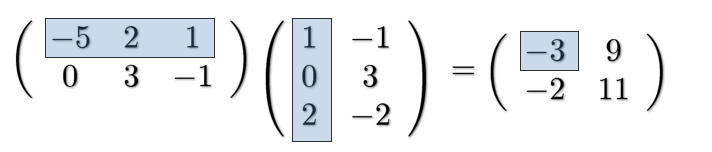

# Vectors and Matrices

A matrix or a vector is a way of representing a collection of numbers

* Vectors are order 1 (row & column) and can be used to represent:
  * points in space
  * directions in space
  * velocity
  * general arrays
* Matrices are order 2 (rows & columns) and can be used to represent:
  * images
  * datasets
  * transformations of vectors
  * parameters of artificial neural networks

## Vectors

**Notation:**
$$
\vec x = (5) \in \R^1
$$
**Column vector:**

**Row vector:**

**Interpretation:**

## Multiplying Numbers with Vectors

$$
\vec x \in \R^3\ and\ a \in \R \\
a \cdot \vec x = a \cdot
  \left(
    \begin{array}{}
      x_1\\
      x_2\\
      x_3
    \end{array}
  \right) = 
    \left(
    \begin{array}{}
      a \cdot x_1\\
      a \cdot x_2\\
      a \cdot x_3
    \end{array}
  \right)
$$

## Adding Vectors

$$
\vec x + \vec y =
\left(
    \begin{array}{}
      x_1\\
      x_2\\
      x_3
    \end{array}
  \right)
  +
  \left(
  \begin{array}{}
  y_1\\
  y_2\\
  y_3
  \end{array}
  \right)
  =
    \left(
    \begin{array}{}
      x_1 + y_1\\
      x_2 + y_2\\
      x_3 + y_3
    \end{array}
  \right)
$$

## Basis Vectors

Every vector can be expressed as a combination of basis vectors
$$
\vec e_1 =   \left(
    \begin{array}{}
      1\\
      0\\
      0
    \end{array}
  \right)
  \ \ 
  \vec e_2=   \left(
    \begin{array}{}
      0\\
      1\\
      0
    \end{array}
  \right)
  \ \
  \vec e_3 =   \left(
    \begin{array}{}
      0\\
      0\\
      1
    \end{array}
  \right)
$$

$$
\left(
    \begin{array}{}
      x_1\\
      x_2\\
      x_3
    \end{array}
  \right)
  =
  x_1 \cdot \vec e_1 + x_2 \cdot \vec e_2 + x_3 \cdot \vec e_3
$$

## Matrices

Row first, column second
$$
A =   \left(
    \begin{array}{}
      a_{11}\ a_{12}\ a_{13}\\
      a_{21}\ a_{22}\ a_{23}\\
      a_{31}\ a_{32}\ a_{33}\
    \end{array}
  \right)
  = (a_{ij}) \in M(3,3)
$$

## Adding and Subtracting Matrices

* Same as for vectors
* Associativity
* Commutativity

## Matrix-Vector Multiplication

* Result is a vector!

$$
A \vec x =   A =   \left(
    \begin{array}{}
      a_{11}\ a_{12}\ a_{13}\\
      a_{21}\ a_{22}\ a_{23}\\
      a_{31}\ a_{32}\ a_{33}\
    \end{array}
  \right)
  
  \left(
    \begin{array}{}
      x_1\\
      x_2\\
      x_3
    \end{array}
  \right)
  =
  \left(
    \begin{array}{}
      a_{11}x_1 + a_{12}x_2 + a_{13}x_3\\
      a_{21}x_1 + a_{22}x_2 + a_{23}x_3\\
      a_{31}x_1 + a_{32}x_2 + a_{33}x_3\
    \end{array}
  \right)
$$

### Properties of Matric-Vector Multiplication

Linear (both ways):
$$
A(\vec x + \vec y) = A \vec x + A \vec y \\
(A + B)\vec x = A \vec x + B \vec x
$$
Associative:
$$
(A \cdot B)\vec x = A(B\vec x)
$$

## Reminder: Summation Notation

$$
(A\vec x)_i =  \sum^3_{j=1}a_{ij}x_j=a_{i1}x_1+a_{i2}x_2+a_{i3}x_3
$$

## Matrix Multiplication

Much easier:
$$
(A \cdot B)_{ij} = \sum^3_{k=1}a_{ik}b_{kj}
$$

### Properties of Matrix Multiplication

* Associativity
* **NOT** commutative!! A * B =\= B * A

## Non-Square Matrices

* Summation index must always have the same range

## Scalar Product

The scalar product of two vectors is defined as:
$$
\vec x \cdot \vec y := \sum^3_{i=1} x_iy_i \ \ \ also\ denoted\ as\ <\vec x, \vec y> \\
\left(
    \begin{array}{}
      x_1\ x_2\ x_3
    \end{array}
  \right)
  
  \left(
    \begin{array}{}
      y_1\\
      y_2\\
      y_3
    \end{array}
  \right)
  = x_1y_1+x_2y_2+x_3y_3
$$

## Length and Distances

Length:
$$
\vec x \ is\ ||\vec x|| := \sqrt{\sum^n_{i=1}x^2_i} = \sqrt{\vec x \cdot \vec x}
$$
Distance:
$$
d(\vec x, \vec y) = ||\vec x - \vec y||
$$
