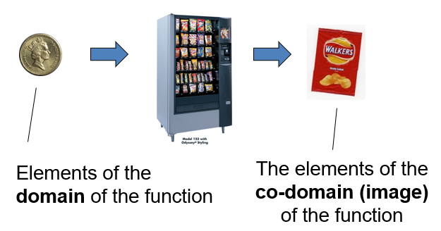
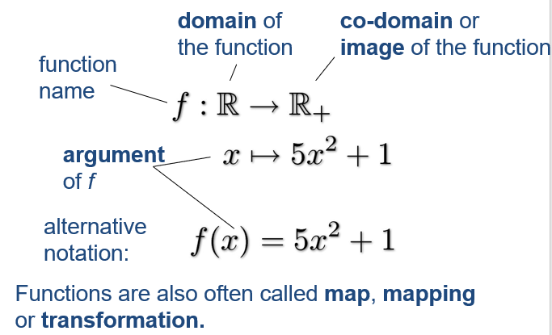
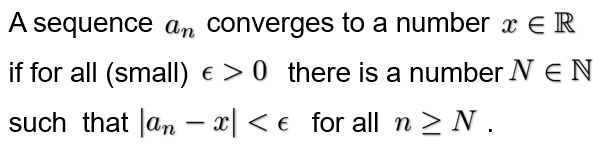

# Functions and Limits

A function is a like a vending machine:

## Notation

$$
f:\R \rightarrow \R_+ \\
x \mapsto x^2 \\
$$
Alternative notation:
$$
f(x)=x^2
$$

## Example 1

$$
1 \mapsto 1 \ \ \ \ f(1) = 1 \\
\sqrt2 \mapsto 2 \ \ \ \ f(\sqrt2) = 2 \\
2 \mapsto 4 \ \ \ \ f(2) = 4
$$

## Graph of a Function

The graph of a function are all pairs (points) (x, f(x))
$$
f(x)=1.5 \cdot x
$$

## Limits

Problem, what happens if we make n ever and ever larger?:
$$
a_n=\frac{1}{n}
$$
Mathematicians write:
$$
\lim_{n\rightarrow \infin} \frac{1}{n}=0
$$
Two typical cases:

* The number diverges (to infinity)
* The number converges (here to 0)

## Formal Definition

## Practical Rules for Limits

$$
\lim_{n\rightarrow \infin} (a_n+b_n) = \lim_{n\rightarrow \infin} a_n + \lim_{n\rightarrow \infin} b_n 
\\
\lim_{n\rightarrow \infin} (a_n \cdot b_n) = \lim_{n\rightarrow \infin} a_n \cdot \lim_{n\rightarrow \infin} b_n 
\\
\lim_{n\rightarrow \infin} (k \cdot a_n) = k \cdot \lim_{n \rightarrow \infin} a_n
$$

## Thumb Rules for Calculating Limits

$$
If\ \lim_{x \rightarrow \infin} x = \infin \\
then\ \lim_{x \rightarrow\ \infin} \frac{1}{x} = \frac{1}{\infin}=0
$$

$$
k \cdot \infin = {\infin\ if\ k \gt 0 \brace -\infin\ if\ k \lt 0}
$$

$$
\frac{k}{0} = {\infin\ if\ k \gt 0 \brace -\infin\ if\ k \lt 0}
$$

## Not Everything Converges or Diverges

For example:
$$
\lim_{n \rightarrow \infin} sin(n)
$$
