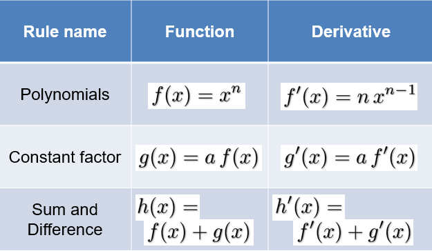
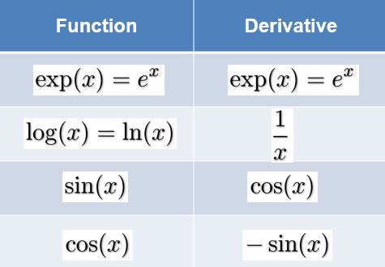

# Derivatives

For linear functions:
$$
f(x) = a \cdot x
$$

The slope/derivative is the ratio of the change of f(x) and the change of x
$$
\frac{\Delta y}{\Delta x} = \frac{f(x\ +\Delta x)-f(x)}{\Delta x}
$$

## Calculating the Linear Example

$$
f(x) = 1.5 \cdot x \\
\frac{\Delta y}{\Delta x} = \frac{f(x\ +\Delta x)-f(x)}{\Delta x} \\
=\frac{1.5 \cdot (x+\Delta x) - 1.5 \cdot x}{\Delta x}
$$

Linear functions are easy because the slope is the same everywhere. We can make our delta x any size we want and get the same value

## Generalisation for any Smooth Function

The more and more we zoom in, the more linear a curved line looks:

|  |  |
| :--------------------------------------------: | :--------------------------------------------: |

## Derivative of a Smooth Function

The derivative of a smooth function is the value the ratio:
$$
\frac{f(x +\Delta x)-f(x)}{\Delta x}
$$
converges to for smaller and smaller delta x, mathematicians write:
$$
f'(x)=\lim_{\Delta x \rightarrow 0} \frac{f(x+\Delta x) - f(x)}{\Delta x}
$$

## Alternative Notation

$$
If\ f:\R \rightarrow R\ is\ a\ smooth\ function \\
x \mapsto f(x) \\
Then\ the\ derivative\ of\ f\ is\ denoted\ as: \\
f'(x) = \frac{df(x)}{dx} = \frac{df}{dx} = \frac{d}{dx}f
$$

The derivative f'(x) of a function is again a function because we can calculate it for any point x

## Example

$$
Derivative\ of\ f(x)=x^2 \\
\frac{d}{dx}x^2 = \lim_{\Delta x \rightarrow 0} \frac{(x+\Delta x)^2 - x^2}{\Delta x} \\
= \lim_{\Delta x \rightarrow 0} \frac{x^2+2x\Delta x+(\Delta x)^2 - x^2}{\Delta x} \\
= \lim_{\Delta x \rightarrow 0} 2x+ \Delta x = 2x
$$

## Applications

* If f(x) is your distance from home as a function of the time x. Then f'(x) is the speed you are driving towards (or away) from home
* If you take the derivative of the derivative f''(x), then that would be your acceleration

* If f(x) describes the height of a hill, then f'(x) is the steepness

* f(x) is your total money as a function of time, f'(x) is your instantaneous spending rate

## Derivative of a Polynomial

$$
f(x)=x^2 \\
f'(x)=2x
$$

Generally:
$$
for\ f(x)=x^n \\
the\ derivative\ is\ f'(x)=nx^{n-1}
$$

## Derivatives: Basic Rules

## Derivatives: Special Functions

## Product Rule

Function:
$$
h(x)=f(x) \cdot g(x)
$$
Derivative:
$$
h'(x) = f'(x) \cdot g(x) + f(x) \cdot g'(x)
$$

## Example

$$
f(x) = sin(x) \cdot cos(x) \\
f'(x) = (cos(x)) \cdot cos(x)) + (sin(x) \cdot -sin(x)) \\
f'(x) = cos(x)^2 - sin(x)^2
$$

## Function Composition

$$
g: A \rightarrow B \\
x \mapsto g(x) \\
f: B \rightarrow C \\
x \mapsto f(x) \\
then\ f \circ g : A \rightarrow C \\
x \mapsto f(g(x))
$$

## Chain Rule

Function:
$$
h(x) = f(g(x)) \ \ \ \ \ \ \ \ \ \ \ \ \ \ \ \ \ \ \ h=f \circ g
$$
Derivative:
$$
h'(x) = f'(g(x)) \cdot g'(x)\ \ \ \ \ \ \ \ \ \ \ \ \ \ \ \ \ \ \ h' = f'\circ g\cdot g'
$$

## Example

$$
f(x) = sin(x^3) \\
f'(x) = cos(x^3)3x^2
$$

$$
f(x)=log(2x^2) \\
f'(x)= \frac{1}{2x^2}4x
$$

## Derivatives in more than 1 Dimension

$$
f(x_1,x_2) = (x_1)^2+(x_2)^2 \\
Partial\ deritivate\ \frac{\delta f}{\delta x_1}\ is\ taking\ the\ derivative\ and\ treat\ x_1\ as\ constant
$$

$$
\frac{\delta f}{\delta x_1} = \frac{\delta}{\delta x_1}((x_1)^2 + (x_2)^2) \\
= \frac{\delta}{\delta x_1}(x_1)^2 + \frac{\delta}{\delta x_1}(x_2)^2 \\
= 2x_1 + 0 = 2x_1 \\
\frac{\delta f}{\delta x_2} = 2x_2
$$

## Interpretation

The partial derivative (delta f / delta x~1~) shows how much f changes when x~1~ is changed.

The gradient gives the direction of the steepest slope:
$$
grad\ f = \left(
    \begin{array}{}
      \frac{\delta f}{\delta x_1} \\
      \frac{\delta f}{\delta x_2}
    \end{array}
  \right)
$$
for example:
$$
f(x_1,x_2) = (x_1)^2 + (x_2)^2 \\
grad\ f = \left(
    \begin{array}{}
      \frac{\delta f}{\delta x_1} \\
      \frac{\delta f}{\delta x_2}
    \end{array}
  \right)
  =
  \left(
    \begin{array}{}
      2x_1 \\
      2x_2
    \end{array}
  \right)
$$

## Applications

* Gradients are important for finding minima (so called gradient descent):
  * If you always go against the gradient, you go the steepest way down
* The gradient can tell you when you are in a (local) extremum (minimum or maximum):
  * In this case the gradient is 0

