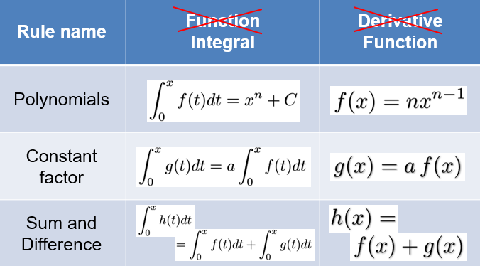
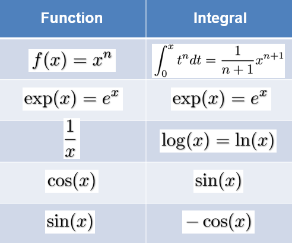

# Integration

Integration is to do with the area of a graph

* Car travelling at 70mph
* A = v\*t = 70\*2 = 140miles

However, what is the area for the section underneath a curved line?

## Lower Reimann Sum

$$
A_\_ = \sum^4_{i=0}f_\_(i \cdot \Delta x) \cdot \Delta x \\
f_\_(x) = min\{f(z):z \in [x,x + \Delta x]\}
$$

## Upper Riemann Sum

$$
A_+ = \sum^4_{i=0}f_+ (i \cdot \Delta x) \cdot \Delta x \\
f_+(x) = max\{f(z): z \in [x,x + \Delta x]\}
$$

## A_ <= A <= A+

## Reimann Integral

For many functions:
$$
\lim_{\Delta x \rightarrow 0} A_\_ = \lim_{\Delta x \rightarrow 0} A_+
$$
The upper and lower Reimann sum become the same for small steps, such functions are called Riemann Integrable, hence where we get Riemann Integral from.

## Notation

Integration is the opposite of differentiation!

## Rules for Differentiation

## Special Functions

