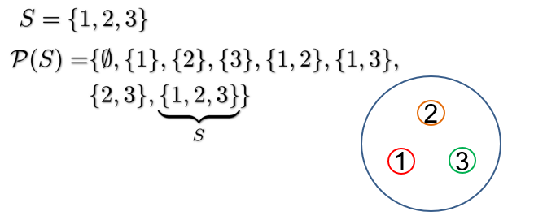
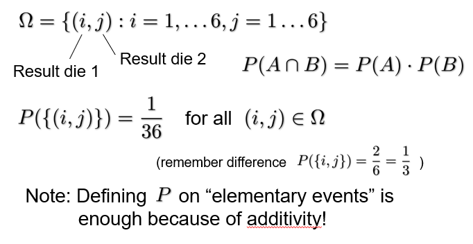
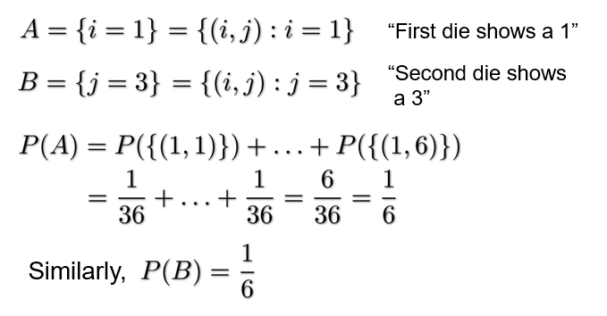
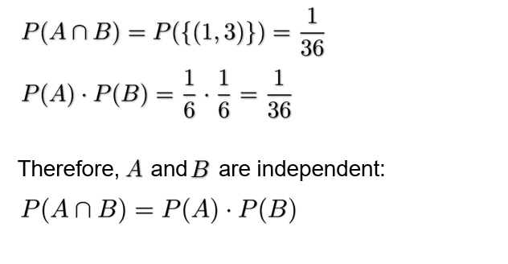
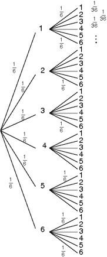
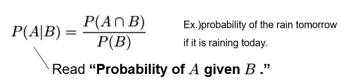
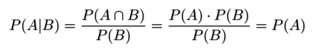
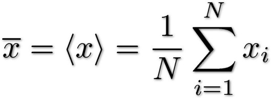
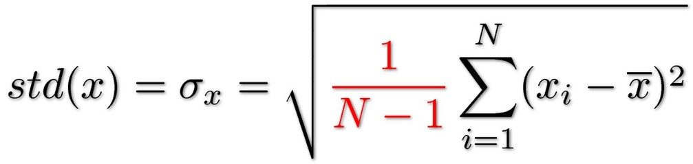

# Probability Theory

We are only going to study discrete probability spaces here

## Power Set

For a set ***S***, the power set ***P(S)*** is the set of all subsets of ***S*** including ***S*** and the empty set

## Probability Measure

Definitions:
$$
\Omega : Set\ of\ elementary\ events \\
\omega \in \Omega : Elementary\ event \\
A\ probability\ measure\ is\ a\ function \\
p:P(\Omega)\rightarrow[0,1] \\
\omega \mapsto P(\omega)
$$
Typical example. Outcome of throwing a die:
$$
\Omega = \{1,2,3,4,5,6\} \\
P(\{i\}) = \frac{1}{6} \\
P(\{i, j\}) = \frac{2}{6} = \frac{1}{3} \\
P(\Omega) = 1
$$

## Probability

$$
We\ call\ the\ subsets\ of\ \Omega\ events\ and\ for\ an\ event\ A\ \subset \Omega\ we\ call\ P(A)\ the\ probability\ of\ the\ event\ A
$$

## Probability Space

$$
For\ (\Omega, P)\ to\ be\ a\ proper\ probability\ space,\ the\ following\ conditions\ must\ hold: \\
P(\Omega) = 1 \\
P(\empty) = 0 \\
if\ A \cap B = \empty\ (A\ and\ B\ are\ disjoint\ or\ exclusive\ events) \\
P(A \cup B) = P(A) + P(B) \\
(Additivity)
$$

## Example

$$
\Omega = \{1,2,3,4,5,6\} \\
P(\{i\}) = \frac{1}{6}\ for\ i=1,\dots,6 \\
Event\ A = \{Number\ is\ even\} \\
P(A) = P(\{2,4,6\}) \ \ \ \ \ \ \ \ \ \ \ \ (\{2,4,6\} = \{2\} \cup \{4\} \cup \{6\}) \\
= P(\{2\}) + P(\{4\}) + P(\{6\}) \\
= \frac{1}{6} + \frac{1}{6} + \frac{1}{6} = \frac{1}{3} + \frac{1}{3} = \frac{1}{2}
$$

## Probability of the Complement

$$
Let\ A \subset \Omega\ be\ an\ event \\
A^C = \Omega \backslash A\ or,\ equivalently,\ A \cup A^C = \Omega\ and\ A \cap A^C = \empty \\
Therefore, \\
P(A \cup A^C) = P(A) + P(A^C) = P(\Omega) = 1 \\
P(A^C) = 1 - P(A)
$$

## Example

$$
P(\{even\}) = 1-P(\{odd\})
$$

$$
P(\{1,2,3,4,5\}) = 1-P(\{6\})
$$

$$
P(\{at\ leaast\ one\ 1\}) = 1 - P(\{no\ 1\}) \\
= 1 - \prod^{10}_{i=1}P(\{die\ i\ not\ 1\}) = 1 - (1 - P(\{1\}))^{10}
$$

## Independence

Two events ***A*** and ***B*** are independent if, and only if:
$$
P(A \cap B) = P(A) \cdot P(B)
$$

## Example (two dice)

## Tree Graph

* Each branch is one outcome
* At each branch we note the probability of that outcome (1/6)
* The total probability of the outcomes is the product of the probabilities along branches (1/36)
* For readability, we should only draw the branches we are interested in

## Conditional Probabilities

It is called a conditional probability.

For independent events:

## Example: One die

$$
\Omega = \{1,2,3,4,5,6\} \\
A = \{i\ even\} \ \ \ \ \ P(A)=\frac{1}{2} \\
B = \{i \geq 2\} \ \ \ \ \ P(B)=\frac{5}{6} \\
P(A \cap B) = P(\{2,4,6\}) = \frac{1}{2} \\
P(A|B) = \frac{P(A \cap B)}{P(B)} = \frac{\frac{1}{2}}{\frac{5}{6}} = \frac{1}{2} \cdot \frac{6}{5} = \frac{3}{5}
$$

## Bayes Rule

$$
P(A|B) = \frac{P(B|A) \cdot P(A)}{P(B)}
$$

## Example

Q. You pick a gold coin from one of two colour bags. What is the probability you picked from the red bag given this result?

$$
P(A|B) = \frac{P(B|A) \cdot P(A)}{P(B)} = \frac{\frac{2}{5} \cdot \frac{1}{2}}{\frac{3}{10}} = \frac{2}{3} \gt P(A) \\
$$
Now, what is the probability of drawing a gold coin after selecting the red bag:
$$
A:Pick\ the\ red\ bag\ \ \ \ \ P(A) = \frac{1}{2} \\
B: Draw\ a\ gold\ coin\ \ \ \ \ P(B) = \frac{3}{10} \\
(B|A): Draw\ a\ gold\ coin\ after\ selecting\ the\ red\ bag\ \ \ \ \ P(B|A) = \frac{2}{5}
$$

## Statistics

In statistics we do not know the underlying probability space. We have a number of samples rather than information on the system they originate from.

## Mean

The mean of a set of observations (the average)
$$
\{x_i\}, i=1, \dots, \N \\
$$
is defined as

## Standard Deviation

The standard deviation of a set of observations
$$
\{x_i\}, i=1, \dots, \N \\
$$
is defined as

* This is the same name as the standard deviation in probability theory

Why the N-1 term?

* Most people put 1/(N-1) to achieve what is called an unbiased estimator

## Median

The median of a set of observations
$$
\{x_i\}, i=1, \dots, \N \\
$$
is the value x~j~ such that half of the x~i~ are larger and half of them are smaller than x~j~ (if the sample set has an even number of samples we take the middle (average) of the 'middle samples')

