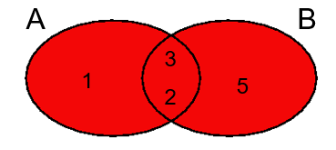
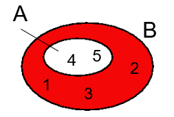
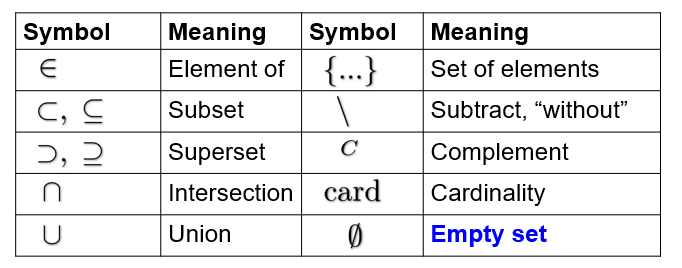

# Sets

Sets are collections of elements. The general notation uses curly braces {1, 2, 3, 4}

 = {1, 2, 3, 4, ...}

## Set Relations

$$
A\ is\ a\ subset\ of\ B\\ A \subset B \\                                                 A\ is\ a\ subset\ of\ or\ equal\ to\ A \\  A \subseteq B \\\\                             B\ is\ a\ superset\ of\ A \\  B \supset A \\                                             B\ is\ a\ superset\ of\ or\ equal\ A \\ B \supseteq A
$$

$$
A = \{1,2,3,4,5,6\},\ B=\{1,2,3\} \\
A \supset B\ \ \ \ \ B \subset A
$$

## Cardinality

The cardinality of a set is the number of elements in the set:
$$
A = \{1,2,5,19\} \\
card(A) = |A| = 4 \\
card(\N) = \infin
$$

## Union

$$
A \cup B = \{x : x \in A\ or\ x \in B \} \\
\{1,2,3\} \cup \{2,3,5\} = \{1,2,3,5\}
$$

## Intersection

$$
A \cap B = \{x : x \in A\ and\ x \in B\} \\
\{1,2,3\} \cap \{2,3,4\} = \{2,3\}
$$

## Subtraction

$$
A \setminus B = \{x \in A : x \notin B \} \\
\{1,2,3,4\} \setminus \{1,3\} = \{2,4\}
$$

## Compliment

$$
if\ A \subset B\ then\ A^C=B \setminus A \\
A^C\ is\ the\ complement\ of\ A\ in\ B \\
B = \{1,2,3,4,5\},\ A = \{4,5\} \\
A^C = \{1,2,3\}
$$

## Symbols

