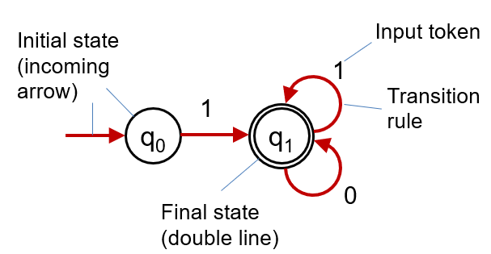
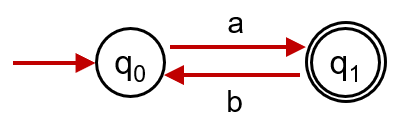
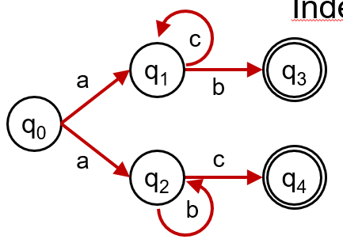

# Finite State Automata (FSA)

* Examples of a model of computing
* These models are how computer scientists make sense of the world
* FSA are in a sense the most simple ones

## Characteristics

* Discrete inputs
* System in one of a finite number of internal configurations
* State encodes information about all past inputs needed to determine behaviour of system on subsequent inputs

## Deterministic Finite State Automata (FSA)

* Finite number of states q~0~, q~1~, q~2~,..., q~n~ and an input tape with input symbols/tokens
* FSA is in one state at a time
  * One initial state
  * One final state
* Symbols on the input tape are consumed one by one
* For each state there is a finite set of rules for state transitions

## Purpose of FSA

* Describes a decision process
* Is the string/input acceptable?
  * An input must be either accepted or rejected
* All acceptable strings form a language

## Outcomes

* Acceptable computation:
  * Computation in which the machine reaches a final state and consumes all the input
* Non-accepting computation:
  * Computation in which either the machine gets stuck before the end of an input or finishes in a non-final state

## What's Accepted

* An automaton defines a language: The set of all strings which when given as input give rise to an accepting computation.
* The family of languages accepted by an FSA: Collection of all languages which some finite state machine accepts. - Turns out to be the family of Regular Languages

## Example 1

* Accepts any string that begins and ends with an a, and any alternating a's and b's

$$
More\ precisely:\ \{a(ba)^n:n\geq0\}
$$

* Regular expression = a(ba)*

## Indeterministic FSA

* Accepts either a then b's then c, or a then c's then b

$$
More\ precisely:\ \{ab^nc:n\geq0\} \cup \{ac^nb:n\geq0\}
$$

* Regular expression = (ab*c)|(ac\*b)
* Nondeterministic!

## Non-determinism

* When the machine has a choice of more than one legal move/state change
* Nondeterminism arises with many computational models

## Deterministic vs Nondeterministic FSA

* Deterministic: there is never a choice in computation
* Non-deterministic: there is a choice in computation
* Non-deterministic FSA are equivalent to deterministic FSA:
  * For every FSA there is an equivalent deterministic FSA