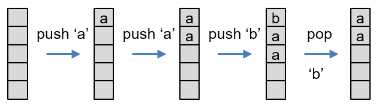
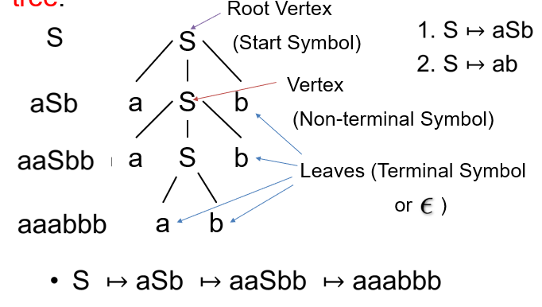

# Pushdown Automata (PDA)

FSAs cannot process nested structures:

* if-then-else
* procedure calls

We need the power to process strings of brackets, e.g. ([{}()])

## Processing Nested Structures

* Memory requirements:
  * unlimited unless we limit the depth of nesting
  * need to keep track of the order in which brackets are closed
  * we have a linear sequence of symbols

## Pushdown (PD)

Like a stack, in which you stack elements on the top of the ones underneath.

* A special kind of list
* Provides unbounded storage
* Last In First Out (LIFO)
* Add/remove items only from one end (top)
* Push - add an element to the top of the PD
* Pop - remove an element from the top of the PD

* Result of adding a pushdown storage to FSA gives a more powerful language recogniser
* Provides enough power for programming language analysis (syntax analysis)
* May even be enough for natural language analysis

## How does it work

We now need to specify 3 things:

* Input symbol to be scanned
* Symbol to be popped from pushdown
* Symbol to be pushed onto pushdown

Any of these can be the empty string

Accepting computation:

* Must be in final state
* All input must be consumed
* Pushdown must be empty

Error states:

* When it gets stuck (no rule for the input)
* Cannot pop correct symbol

## Example 1

$$
\{a^nb^n|n\geq0\} \\
Note:\ this\ cannot\ be\ expressed\ with\ a\ regular\ expression!
$$

## Properties of Pushdown Automata:

Family of languages:

* PDA accept the same family of languages as can be expressed by Context Free Grammars
* In other words they accept exactly the Context Free Languages
* Context Free Grammars are used to describe programming language syntax

## Context Free Grammar

* Defined by productions/rules:

$$
S \mapsto aSb \\
S \mapsto ab
$$

* These are applied repeatedly:

$$
S \mapsto aSb \mapsto aaSbb \mapsto aaabbb
$$

* Generates a's followed by the same number of b's

## Derivation Tree

* Generating a word can be visualised as a tree:

## Limits of Power of PDA

* Can be achieved:
  * Language of palindromes
  * Counting two symbols
  * Programming languages (deterministically)
* What cannot be achieved:
  * Copy language
  * Counting symbols beyond 2

## Performance Consideration

When syntax-checking programs, PDA based checking can take O(n^3^) time, which is very slow for large programs. However, if the PDA is deterministic, time is only O(n).

