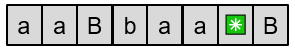
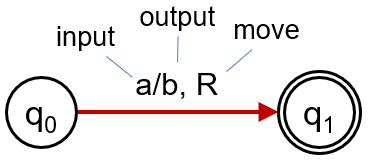
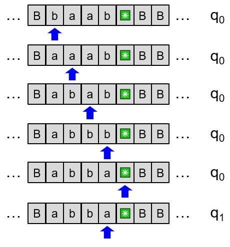
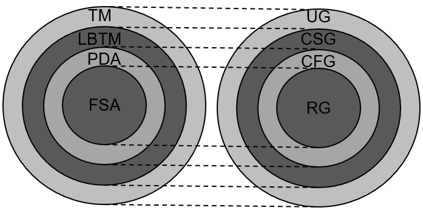

# Turing Machines

* Simple extension to Finite State Machines
* Allows editing of the input tape
* No limit on the size of the tape
* The tape is 2-way infinite

* B stands for blank

## Transitions

* Current state
* New state
* Symbol currently read
* New symbol to replace the read symbol
* Direction to move the tape head (L, R, S (stay))

## Example 1

This machine swaps a to b and b to a until it finds a *:

## Church-Turing Thesis

* Every computable function can be computed by a Turing Machine
* Turing Machines are universal computing machines
* Every problem that can be solved by an algorithm can be solved by a Turing Machine

## More about TM

* The tape can be used to record any data for later access
* There is always space available after last non-blank location
* There is no limit how often tape is accessed

## Efficiency

* TM are universal but not efficient
* Progress can be really slow
* Looking up memory involves sequential access - the opposite of efficiency

## Chomsky Hierarchy

* **Type 0**: Languages accepted by **Turing Machines**
* **Type 1**: Languages accepted by **Turing Machines** with **linear bounded storage**
* **Type 2**: Languages accepted by **Pushdown Automata**
* **Type 3**: Languages accepted by **Finite State Automata**

## Equivalent Grammar Formalisms

* **Type 0**: Languages generated by **unrestricted grammars**
* **Type 1**: Languages generated by **context-sensitive grammars**
* **Type 2**: Languages generated by **context-free grammars**
* **Type 3**: Languages generated by **regular grammars**

